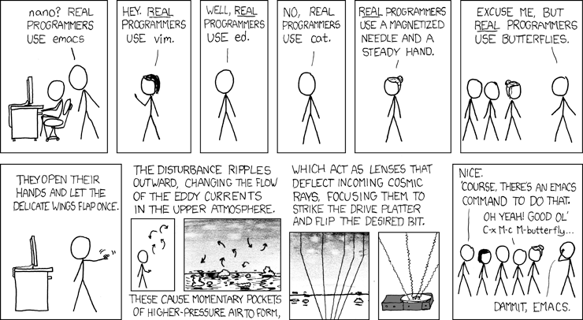

# Lab 1:

Lab 1 is about setting up your Python development environment and getting started with basic Python programming.
It contains three exercises. 
Exercise 1 is about setting up your Python development environment. **It is to a degree optional!**
If you want to use your own setup and already have one that works for you, you can skip this exercise.
Also, if you only want to use Jupyter Notebooks on a remote server or in **google colab**, you can skip this exercise.

You can access a jupyter notebook server with the following link:

## https://inf-jhub.inf.fh-rosenheim.de/


Exercise 2 is about working through basic Python programming tasks and getting familiar with notebooks. 
The concepts will repeat some of the things you learned in the lectures in Intro to AI-I.
Exercise 3 is about your personal understanding with a very basic python programming task with training wheels off.
https://inf-jhub.inf.fh-rosenheim.de/

# Exercise 1: Setting up your Python development environment

Handling different versions of python and Python libraries is an essential part of working with Python. 
As you will recall from the lectures, Python is an interpreted language.
Programs written in Python do not have to be compiled but are interpreted at runtime.
Using the right interpreter version has implications on what language features are availabe or how certain task are done. You will figure out such cases later as you go on to be an avid Python user. 

For the exercises and everything in this course I recommend you to use a UNIX-based system. 
So either Linux or MacOS. In case you're on Windows, please do yourself a favour and use the Linux Subsystem for Windows, which should make setup and working with Python easier. 

## A word about shell environments:

In case you are not already familiar with it, the shell is a command-line interface to your operating system.
It allows for the execution of commands and scripts.
The default shell on most Linux systems is `bash`, macOS uses `zsh`. These are both Unix shells.
The emulate a terminal (physical access to a computer), which is a text-based interface to the shell.
You got to get used to it, as it is a powerful tool for managing your system and your Python environment.
A very basic introduction can be found [here](https://www.geeksforgeeks.org/basic-shell-commands-in-linux/?ref=lbp).

**Important**: Please don't just run the commands below without knowing what they are doing!

### Questions to ask yourself when working with a Terminal emulator:
- What does the command do?
- What are the implications of running it?
- What are possible side effects?
- Where am I? (What directory am I in?) 
  - Does this have implications on the command I am about to run?
  - The `pwd` command is your friend here.

## Check your Python version

Open the terminal interpreter of your choice and type into the shell:

```bash
python --version
```

I recommend using a version of at least 3.8.
In case your version is below this, please install a newer version.

Important: Never remove/uninstall a system provided pre-installed Python interpreter. 
Sometimes they are used in some of the tooling your OS is depending on. 
Always aim for parallel installation. 

## Install pyenv

**pyenv** lets you switch between multiple versions of Python. 
It's a simple tool with the sole purpose of helping you manage multiple Python interpreter versions.

### MacOS

If you're on MacOS, if you havent done it yet, get the package manager **homebrew**. 
This makes things like installing and managing certain types of applications a lot easier on MacOS.
Also install **pyenv-virtualenv**, which is a plugin for pyenv to manage virtual environments.
More on virutal envs later.

```bash
brew install pyenv
brew install pyenv-virtualenv
```

### Linux & Linux Subsystem for Windows

Download and use the auto installer (by piping it to a shell).

```bash
curl https://pyenv.run | bash
```
For the **pyenv** virtualenv, you'll have to checkout the plugin to the pyenv dir by typing:
```bash
$ git clone https://github.com/pyenv/pyenv-virtualenv.git $(pyenv root)/plugins/pyenv-virtualenv
```

And depending on what shell you're using either modify the ~/.zshrc or ~/.bashrc file by appending this line:

```
eval "$(pyenv virtualenv-init -)"
```
Don't forget to reload the shell config (`touch ~/.zshrc` or `touch ~/.bashrc`) or just pop up a new shell after modifying the config.

## Install Python 

Have a look at all Python versions that can be installed using pyenv.
Pyenv will ignore your previously installed Python versions and manage and maintain self-contained Python versions.

```bash
pyenv install --list
```

The following command shows you all the Python versions installed using pyenv.

```bash
pyenv versions
```

### Install Python 3.11:

```bash
pyenv install 3.11

```
The following command will set your global python version, the one you call when typing ``python --version`` in your shell environment, to the specified version.

```bash
pyenv global 3.11
```

### Managing Virtual Environments using pyenv

To maintain separation between your Python projects, it's advisable to employ virtual environments.
These environments are self-contained Python setups enabling you to install project-specific packages and dependencies without impacting the system Python or other projects.

## Create and run a hello world program

In any directory you want to (here it's the home dir) type:
```bash
echo "print('Hello World')" >> hello_world.py
python hello_world.py
```

This runs the python hello world program.
Your basic Python setup is now done. In case you need another version, just use the commands above. 
Your virtual environments can have any version of Python you have installed. You just have to specify it.

### Create a virtual environment
Create a virtual environment and install the **ipython** and **numpy** packages.
Run:

```bash
pyenv virtualenv <python-version> <virutal-env-name>
```
Now activate your virtual environment
```bash
pyenv activate <virutal-env-name>
```

To deactivate simply run:
```bash
pyenv deactivate
```

#### Bonus points for modifying your shell in a way, that displays the currently active virtual environment!
#### Bonus points for using the virutalenv wrapper (convenience shell functions for working with virtual environments)

### Installing packages in your virtual environment
To install packages in your virtual environment, you can use the package manager **pip**.
The command bellow installs the packages **ipython** and **numpy** in your virtual environment.

```bash
pip install ipython numpy
```

You can also install packages from a requirements file.
A requirements file is a text file that contains a list of packages you want to install.
It's usually called ``requirements.txt``.
It allows you to specify versions of packages you want to use, so you're able to recreate
the same execution environment you ran your experiments in.
This fosters reproducibility.
The file contents should look like this:

```
ipython
numpy==1.21.2
```

Then you can install the packages by running:
```bash
pip install -r requirements.txt
```

### Freezing your environment
To check which packages are installed in your environment, you can run `pip freeze`.
In order to put the output into a file right away, you can run:
```bash
pip freeze > requirements.txt
```

Install the ipython package using **pip** (or another python package manager).
Python package manager allow you to install Python packages to your environments. This give you access to code other people wrote and special packages for scientific computing.

Make sure your virtual environment is active. Now install iPython:

```
pip install ipython numpy
```

## Using Python REPLs

Access the normal python REPL (Read–eval–print loop):

```
python
```
- import numpy (if it's not installed, install it)
- create an array of all zeros of dimensionality 2x2 (see numpy documentation)
- print the array

Is there any way to make your life a bit easier performing those tasks?

Exit the REPL, try the same typing

```
iPython
```
iPython provides you with a more sophisticated REPL that supports syntax highlighting, automatic indentation, magic commands, and most importantly tab-completion. 
To learn more about the benefits check out the documentation. 

## Install Visual Studio Code + Python and Jupyter plugin



That being said - you can use any editor you like.
I suggest vs-code, because it is beginner-friendly and can be easily configured and customized.
It is free, works cross-platform and the support for Python is good.
You can download it [here](https://code.visualstudio.com/download).

After installing vs-code, open it, select a color scheme. 
Then you can browse for plugins/language plugins.
Install the Python plugin and the Jupyter plugin.

Create a Python file.
Save it in a directory of your choice, could be ``~/iai2_labs/lab0``.
Change your woring directory to this directory in the terminal.

Add some come to the file, e.g.,

```python
name = 'you name'
print("Hello World")
print("Hello" + name)
a = 1
b = 2
c = a + b 
print(c)
```

Got to Run & Debug and Press "Rund and Debug"


Choose create a launch.json file and select Python file.
As your debug config choose Python file with arguments.

The result should look something like this:

```json
{
    "version": "0.2.0",
    "configurations": [
        {
            "name": "Python: Current File",
            "type": "python",
            "request": "launch",
            "program": "${file}",
            "console": "integratedTerminal"
        }
    ]
}
```

The name identifies it in the run and debug menu.
The type is python, the request is launch, the program is the file you are currently working on and the console is the integrated terminal.
You can later add more configurations and options, depending on the programs you are planning to run.

Now go ahead and press the green arrow in to top left corner.

A console should open and display the output of your program.
The debug configuration is saved in a file called ``launch.json`` in the ``.vscode`` directory of your project.
It is customizable and allows you to run your program with different configurations.

In the next exercises we will talk about the use of arguments and how to use the debugger.

### Install Jupyter Notebook

Create another python file and call it ``interactive.py``.
The starting content of the file should be:

```python
#%%
import numpy as np
#%%
print("this is interactive mode")
#%%
arr = np.array([[3,3],[2,2]])
print("this is interactive mode")
#%%
print(arr)
```

The ``#%%`` is a special comment that tells the Jupyter plugin that the code below is a cell / portion of code you want to send to the interpreter.
So either press run next to the cell or press ``shift + enter`` to send the code to the interpreter.
If your virtual environment doesn't have Jupyter and the ipython kernel installed yet, vscode will ask you to install it.
Press install and see your screen split.
The results of the code execution from the cells will appear to the right.
Now you basically have an active REPL as before, but can interact with it using your editor.

The interactive mode allows you to send code to the interpreter line by line.
It is based on the Jupyter Notebook, which is a web-based interactive computing platform.

### Jupyter Notebooks

As already seen in the lecture, Jupyter Notebooks are a great way to combine code, text, and visualizations in a single document.
They are the backbone to the interactive mode in vs-code.
A major advantage of those Jupyter Notebook is, that they can be shared and viewed by others, without the need to install any software.

If you prefer directly using them, you can also do this using vscode.

To create a new Jupyter Notebook, open the command palette (``ctrl + shift + p`` or ``cmd + shift + p``) and type ``Jupyter: Create New Jupyter Notebook``.

Add some code, e.g., hello world to the first cell and run it.
In case you get asked for an environment to run it in, select the one you created before.

Play around a bit with the Jupyter Notebook. Check how to add markdown cells and how to add visualizations.
Check out some keyboard shortcuts and how to navigate them best.
Create new cells, delete them and move them around.

### Jupyter Lab

A better extended version of plain jupyter notebooks is Jupyter Lab.
It allows you to work with multiple files, terminals, and notebooks in one window.
It is a more powerful tool than the classic Jupyter Notebook, as it directly supports file navigation and terminal input.
I would strongly recommend getting familiar with it.

You can install it by installing it in your virtual environment.

```bash
pip install jupyterlab
```
#### Start Jupyter Lab
https://jupyterlab.readthedocs.io/en/latest/getting_started/starting.html
In your active virtual environment run:
```bash
jupyter lab
# with alternative working directory / lab dir
jupyter lab --notebook-dir=/var/ --preferred-dir /var/www/html/example-app/
```
Access the server via URL in the browser or use the link in your vscode as a remote kernel.

More on Jupyter Lab in the documentation [here](https://jupyterlab.readthedocs.io/en/latest/getting_started/overview.html#).


### Debugging

Go back to the Python file you created before.
By clicking on the line number you can set a breakpoint, that will appear as a red dot.

Then press the debug button in the left sidebar.
Code execution will stop at the breakpoint and you can inspect the state of your program.


With the controls on top, you can continue execution of the code. 
In the sidebar on the left you can see the variable explorer and the call stack. 
You can see the values the variables currently have.

Add some more code, make some variable assignments and see how the variable explorer updates when going through the code step by step using the blue arrow in the controls.
You will know this from other debuggers.

### Explore

Overall, this is just a very brief tutorial.
I recommend you to explore for yourself to find out which way you want to work with during this course and maybe in the future. Try the different features and see how you can use them to your advantage.

You are free to also use other editors or IDEs.
Find out what works best for you.
Other valid options are working directly with Jupyter-Lab and Jupyter Notebooks in the browser, PyCharm, Spyder, Atom, Sublime Text, or even Emacs or Vim.

These things will be your tools for the next few years, so it's important to get comfortable with them.

### More on using the Jupyter Notebook

More infos can be found here:
https://code.visualstudio.com/docs/datascience/jupyter-notebooks

### More on interactive Mode
More details can be found here:
https://code.visualstudio.com/docs/python/jupyter-support-py

### More on debugging using vs-code

More infos can be found here:
https://code.visualstudio.com/docs/editor/debugging


# Exercise 2: Working through the introduction to Python Programming notebook

Access the Introduction to Python programming [notebook](./ex02-Introduction-to-Python-Programming.ipynb) in this directory.
To do this, you have to have Jupyter or Jupyter Lab installed in your virtual environment.


# Exercise 3: Training wheels off
Access this [notebook](./ex03_strings_and_lists.ipynb) and show your understanding by solving this basic Python programming tasks.
